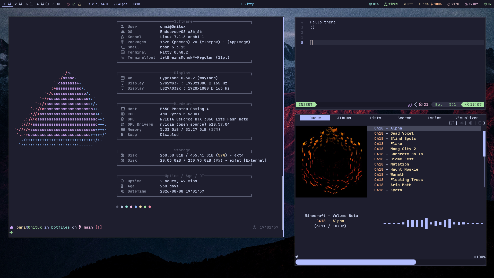

# Saunakatti's Dotfiles

Some of my configs. I manage them with [GNU Stow](https://www.gnu.org/software/stow/). I use [EndeavourOS](https://endeavouros.com/) with [Hyprland](https://github.com/hyprwm/Hyprland). For theming I use the mocha flavour of [Catppuccin](https://github.com/catppuccin/catppuccin).

I've left some configs (mainly ones that I haven't changed much) out of here. I'm also aware that many of the configs are in desperate need of cleaning up. Many of the configs are modified versions of default configs with unnecessary comment lines.

---

## List of included configs

- **btop** – system monitoring (terminal)
- **cava** – audio visualizer (terminal)
- **fastfetch** – display system information quickly (terminal)
- **hypr** – contains configs for hyprland and related tools
  - **hyprland.lua** – hyprland
  - **hyprlock.conf** – lock screen
  - **hypridle.conf** – idle tool
  - **mocha.conf/lua** – color schemes for hyprland.lua and hyprlock.conf
- **kitty** – terminal
- **nvim** – code editor (LazyVim setup) (terminal)
- **rmpc** – music player (uses mpd) (terminal)
- **rofi** – menu I use mainly for apps, windows and emojis
- **wayle** – desktop shell I use for top bar, notifications and OSD
- **yazi** – file manager (terminal)
- **waybar** – top bar (unused, using Wayle instead)

> [!WARNING]
> The waybar configs are outdated. I've moved to [Wayle](https://github.com/wayle-rs/wayle) for now.
> The configs are still accessible and should work.

